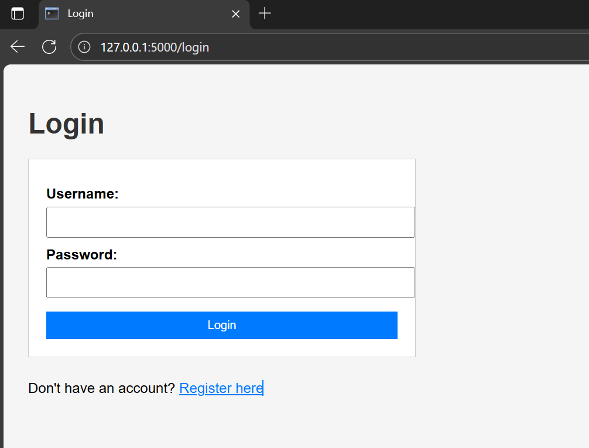
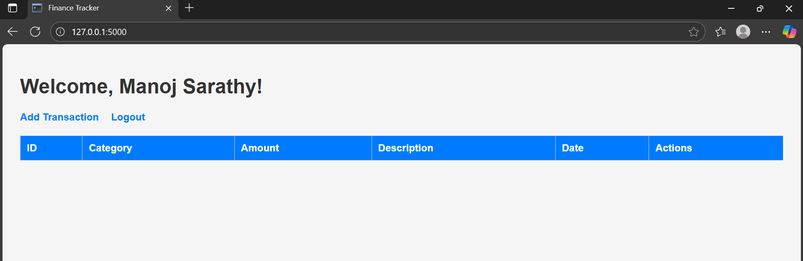
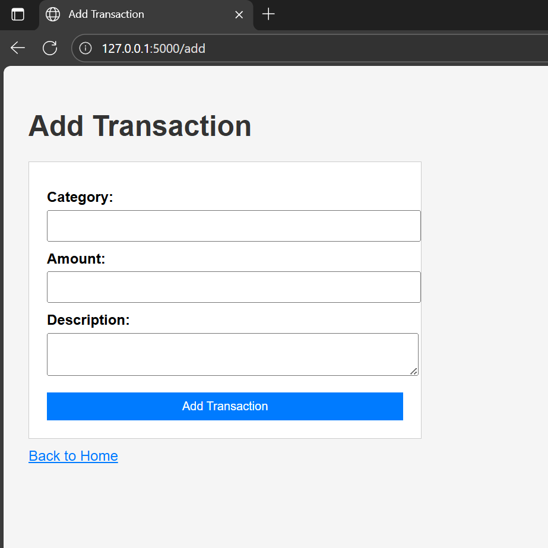

# Personal Finance Tracker Web App


## Overview

This project is a **personal finance management web application** that allows users to **track, categorize, and manage their financial transactions** securely. It demonstrates **full-stack development** with a Flask backend, MySQL database, and responsive HTML/CSS frontend.

Key functionalities include:
- **CRUD operations** for transactions (Add, Edit, Delete, View)  
- **Categorized transaction tracking**  
- **User authentication** for secure access  
- **RESTful API endpoints** for backend integration  

---

## Features

- **Add, Edit, Delete, and View Transactions**  
- **Categorized Transactions** for better financial insight  
- **User Authentication & Secure Login**  
- **SQL-based Data Management (MySQL)**  
- **RESTful API Endpoints** for frontend-backend interaction  
- **Responsive HTML/CSS Frontend**  
- **Version Control with Git/GitHub**  

---

## Tools & Technologies

- **Python 3.10+**  
- **Flask**  
- **MySQL**  
- **HTML & CSS**  
- **Git/GitHub**  

---

## Screenshots

**Login Page**  
  

**Dashboard / Transactions Overview**  
  

**Add Transaction Form**  
  

> *Replace the images in `screenshots/` folder with your actual screenshots.*

---

## System Architecture

```mermaid
flowchart TD
    A[User Interface (HTML/CSS)] --> B[Flask Backend]
    B --> C1[User Authentication Module]
    B --> C2[Transaction CRUD Module]
    B --> C3[RESTful API Endpoints]
    C1 --> D[MySQL Users Table]
    C2 --> D[MySQL Transactions Table]
    C3 --> D[MySQL Database]
    D --> B
    B --> A[UI Response / Dashboard Update]
